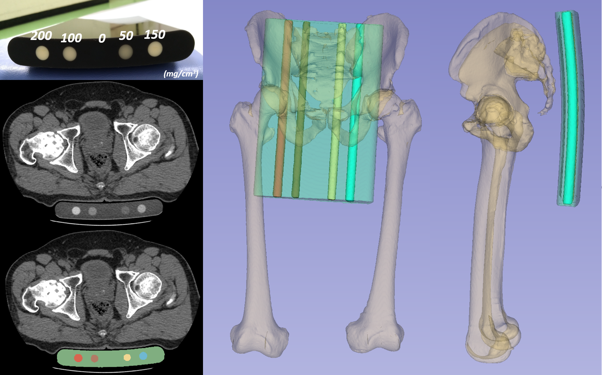

# CT-Intensity-Calibration-Phantom-Segmentation

This software segments the intensity calibration phantom (B-MAS200, Kyoto Kagaku, Kyoto, Japan) from CT images.
The segmentation model was built from convolutional neural network using a Bayesian U-net architecture (https://github.com/yuta-hi/bayesian_unet) and was trained on manual segmentations of 40 cases.

# Requirements
- Python 3
- keras 2.2.3
- CPU or NVIDIA GPU + CUDA CuDNN

For details, please see [requirements.txt](requirements.txt)

# Reference
Preprint of the paper using this model can be found at (http://arxiv.org/abs/2012.11151).  When using this model, please cite 
- Title: 'Automated segmentation of an intensity calibration phantom in clinical CT images using a convolutional neural network'
- Authors: Keisuke Uemura, Yoshito Otake, Masaki Takao, Mazen Soufi, Akihiro Kawasaki, Nobuhiko Sugano, Yoshinobu Sato 

# Usage
 Inference Code for Phantom Segmetation using Bayesian U-net.

 Inputs:
 -  '-i' or '--in_dir' : Directory including MHD images (default: data)
 -  '-o' or '--out_dir' : Directory to save segmentation results (default: results)
 -  '-u', '--uncert_ok' : Flag to save the uncertainty or not (default: False)  

 Examples:
 -  python phantom_segmentation.py -i "./data" -o "./labels" -u
 - python phantom_segmentation.py --in_dir "./data" --out_dir "./labels" --uncert_ok
 -  python phantom_segmentation.py --in_dir "./data" --out_dir "./labels"

# Licence
This software can be used for research purpose or for educational purpose.
For commercial use, please contact the Imaging-based Computational Biomedicine Lab, Nara Institute for Science and Technology, Japan.

For details, please see [LICENCE.txt](LICENCE.txt)
